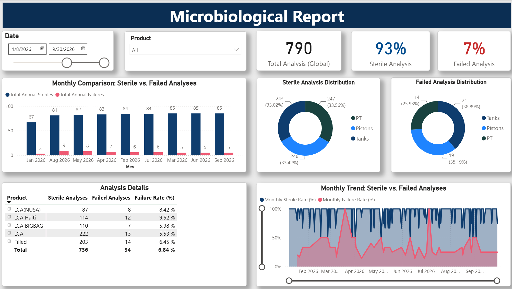
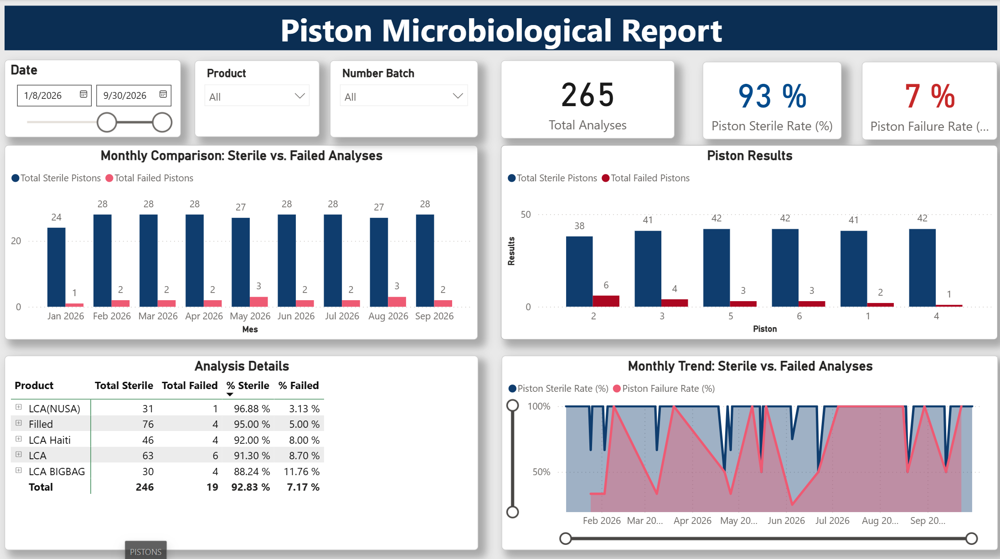
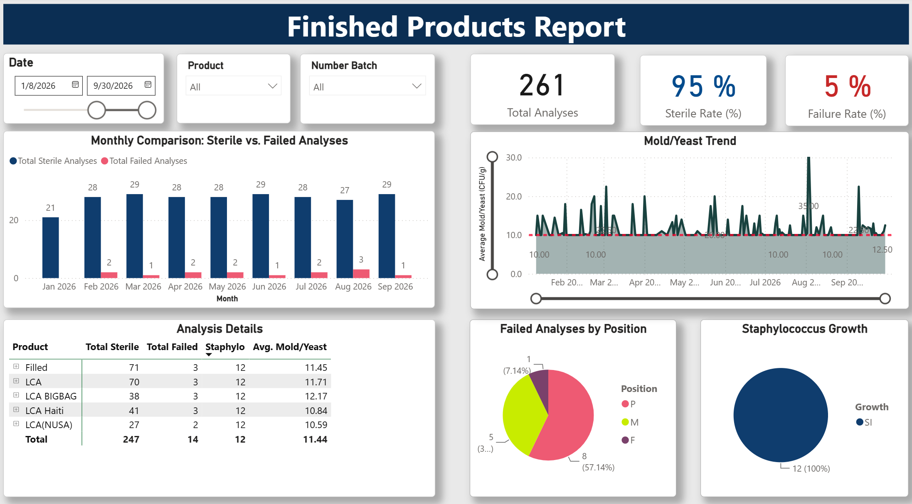
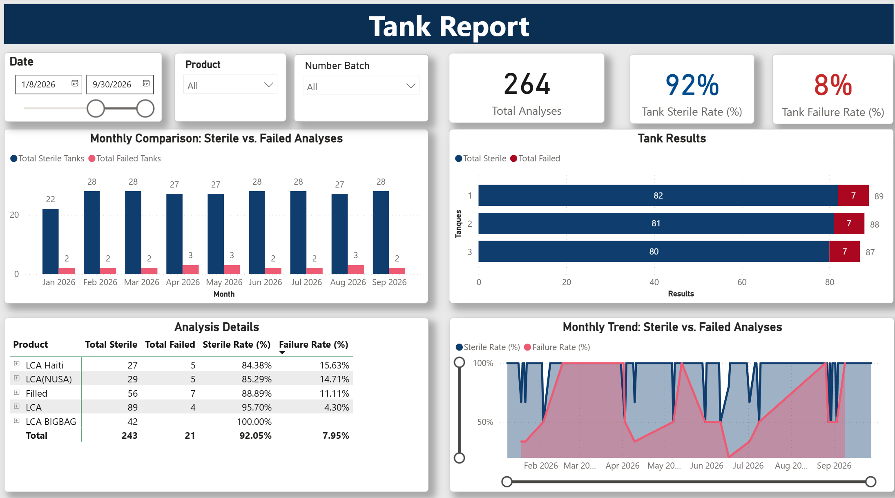
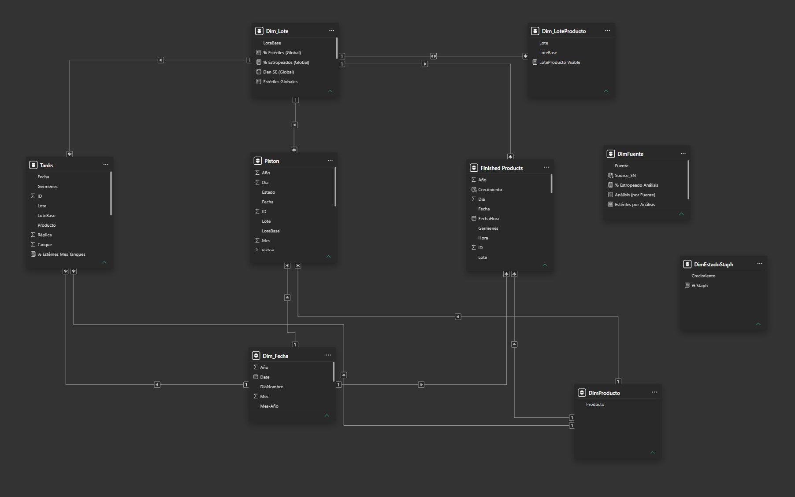

# 🧫 Microbiological Quality Dashboard

### Power BI | Power Query | DAX | Data Modeling

An interactive **Power BI Business Intelligence project** designed to monitor and analyze microbiological quality across different stages of a production process.

The dashboard transforms microbiological records into actionable quality indicators through **data transformation, dimensional modeling, DAX measures, KPI monitoring, and interactive visualization**.

> **Portfolio Project:** The dataset included in this repository is entirely synthetic and was created specifically for demonstration purposes. No confidential or real production data is included.

---

## 📊 Dashboard Overview

The main dashboard provides a consolidated view of microbiological performance across **pistons, tanks, and finished products**.

Users can dynamically filter the analysis by **date and product** while monitoring the overall quality performance.

### Key Performance Indicators

- **Total Analyses** — Total number of microbiological analyses performed.
- **Sterile Analysis Rate** — Percentage of analyses classified as sterile.
- **Failure Rate** — Percentage of analyses that did not meet the sterile condition.
- **Monthly Performance** — Comparison of sterile and failed analyses over time.
- **Source Distribution** — Distribution of results across pistons, tanks, and finished products.
- **Product Performance** — Comparison of microbiological results by product.

---

## 🎯 Business Objective

Microbiological quality control generates operational data across different production areas. Analyzing these records manually can make it difficult to identify trends, compare performance, and detect areas requiring attention.

This project was developed to create a centralized analytical solution capable of:

- Consolidating microbiological analysis records.
- Monitoring sterile and failed results.
- Measuring microbiological quality KPIs.
- Comparing performance over time.
- Identifying products with higher failure rates.
- Analyzing pistons, tanks, and finished products independently.
- Providing interactive filtering by date, product, and batch.
- Transforming operational records into accessible management information.

---

# 📈 Dashboard Pages

## 1. Microbiological Overview

The main report consolidates microbiological results from all monitored areas.

It provides:

- Global analysis volume.
- Overall sterile and failure rates.
- Monthly sterile vs. failed analyses.
- Distribution by analysis source.
- Product-level performance.
- Monthly quality trends.

---

## 2. Piston Microbiological Report

This page focuses specifically on microbiological analyses associated with **pistons**.

### Analysis Available

- Total piston analyses.
- Piston sterile rate.
- Piston failure rate.
- Monthly sterile vs. failed analyses.
- Results by individual piston.
- Product-level microbiological performance.
- Monthly quality trends.

The report allows users to compare individual pistons and identify differences in microbiological performance.

---

## 3. Finished Products Report

The Finished Products report expands the analysis beyond sterile and failed results by incorporating additional microbiological indicators.

### Indicators Monitored

- Total finished-product analyses.
- Sterile rate.
- Failure rate.
- Mold and yeast levels.
- Staphylococcus growth.
- Failed analyses by sampling position.
- Product-level microbiological results.
- Monthly performance.

This page demonstrates how different microbiological indicators can be integrated into the same analytical environment.

---

## 4. Tank Report

This page provides microbiological monitoring across production **tanks**.

### Analysis Available

- Total tank analyses.
- Tank sterile rate.
- Tank failure rate.
- Results by individual tank.
- Monthly sterile vs. failed analyses.
- Product-level performance.
- Monthly microbiological trends.

---

# 🧩 Data Model

The Power BI semantic model integrates microbiological records with supporting dimension tables.

The model contains information related to:

- Pistons
- Tanks
- Finished products
- Dates
- Products
- Production batches
- Analysis sources
- Microbiological status

Dimension tables provide consistent filtering across the different analytical areas, while relationships connect them to the operational datasets.

This structure allows the dashboard to perform cross-filtering and dynamic calculations across multiple report pages.

---

# 🔄 Data Transformation

Data preparation and transformation were performed using **Power Query**.

The ETL process included:

- Data type standardization.
- Date processing.
- Product normalization.
- Batch preparation.
- Microbiological status classification.
- Analysis-source identification.
- Data cleaning.
- Handling of blank values.
- Preparation of fields required for analytical calculations.

The transformation process converts raw operational records into structured information suitable for Business Intelligence analysis.

---

# 🧮 DAX & Analytical Logic

**DAX measures** were developed to calculate the main microbiological quality indicators dynamically.

Examples include:

- Total analyses.
- Total sterile analyses.
- Total failed analyses.
- Sterile rate (%).
- Failure rate (%).
- Monthly sterile rate.
- Monthly failure rate.
- Results by analysis source.
- Product-level quality indicators.
- Piston-specific KPIs.
- Tank-specific KPIs.
- Finished-product KPIs.

Measures dynamically respond to the filter context applied throughout the report.

This allows users to analyze results according to dimensions such as:

**Date → Product → Batch → Analysis Source → Equipment**

---

# 🛠️ Tools & Technologies

| Technology | Application |
| --- | --- |
| **Power BI Desktop** | Dashboard development and interactive visualization |
| **Power Query** | ETL, data cleaning, and transformation |
| **DAX** | Measures, KPIs, and analytical calculations |
| **Microsoft Excel** | Source dataset |
| **Data Modeling** | Relationships and dimensional structure |
| **GitHub** | Version control, documentation, and portfolio presentation |

---

# 📁 Dataset

The repository includes the following dataset:

`microbiological_sample_data.xlsx`

It contains **synthetic microbiological records from January 2025 through September 2026**.

The dataset contains records related to:

- Pistons.
- Tanks.
- Finished products.
- Products.
- Production batches.
- Sterile and failed analyses.
- Mold and yeast measurements.
- Staphylococcus indicators.
- Sampling positions.

The synthetic dataset was designed to reproduce realistic analytical patterns while protecting the confidentiality of the business environment that inspired the project.

---

# 📥 Power BI Project

The complete Power BI dashboard is available in:

`Microbiological_Quality_Dashboard.pbix`

The file can be opened with **Power BI Desktop** to explore:

- Dashboard pages.
- Data model.
- Table relationships.
- Power Query transformations.
- DAX measures.
- Interactive filters and slicers.

---

# 📂 Repository Structure

    powerbi-microbiological-quality-dashboard/
    │
    ├── Microbiological_Quality_Dashboard.pbix
    ├── microbiological_sample_data.xlsx
    ├── README.md
    │
    ├── overview.png
    ├── piston-report.png
    ├── finished-products-report.png
    ├── tank-report.png
    └── data-model.png

---

# 💡 Skills Demonstrated

### Business Intelligence

- KPI design and monitoring
- Dashboard development
- Interactive reporting
- Operational performance monitoring
- Business-oriented data visualization

### Data Analysis

- Data exploration
- Trend analysis
- Comparative analysis
- Quality performance analysis
- Data-driven reporting

### Power BI

- Data modeling
- DAX measures
- Power Query
- Interactive slicers
- Cross-filtering
- Drill-down analysis
- KPI cards
- Time-based analysis
- Data visualization

### Data Preparation

- Excel data integration
- Data cleaning
- Data transformation
- Data standardization
- Dimensional modeling

---

# 🔒 Data Privacy

**This repository does not contain confidential company data.**

All records included in the publicly available Excel dataset are **synthetic and were generated specifically for this portfolio project**.

The project reproduces an operational microbiological quality-monitoring scenario for demonstration purposes while protecting the confidentiality of the original business environment.

---

# 👨‍💻 Author

## Ángel Luis González Delgado

**Systems Engineer | Data Analytics | Business Intelligence | Process Automation**

Interested in transforming operational data into clear and actionable information through data analytics, Business Intelligence, automation, and digital transformation.

This project is part of my professional **Data Analytics & Business Intelligence portfolio**.
